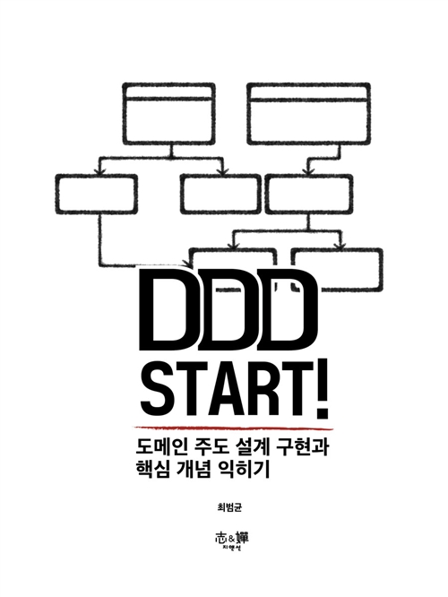
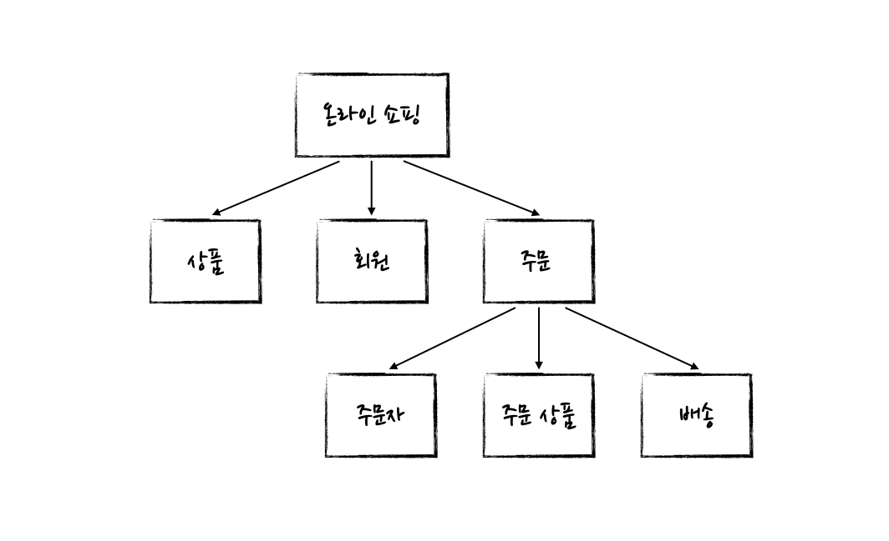
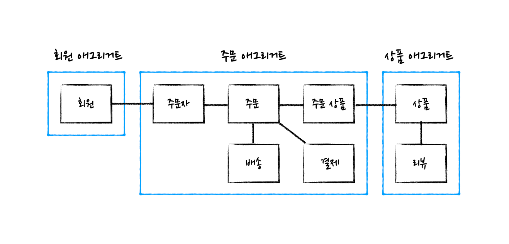
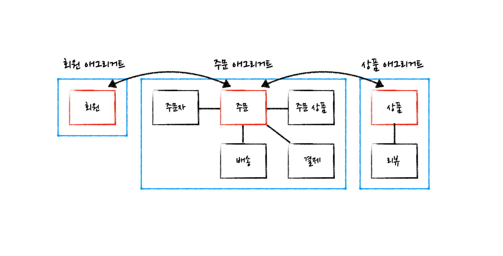
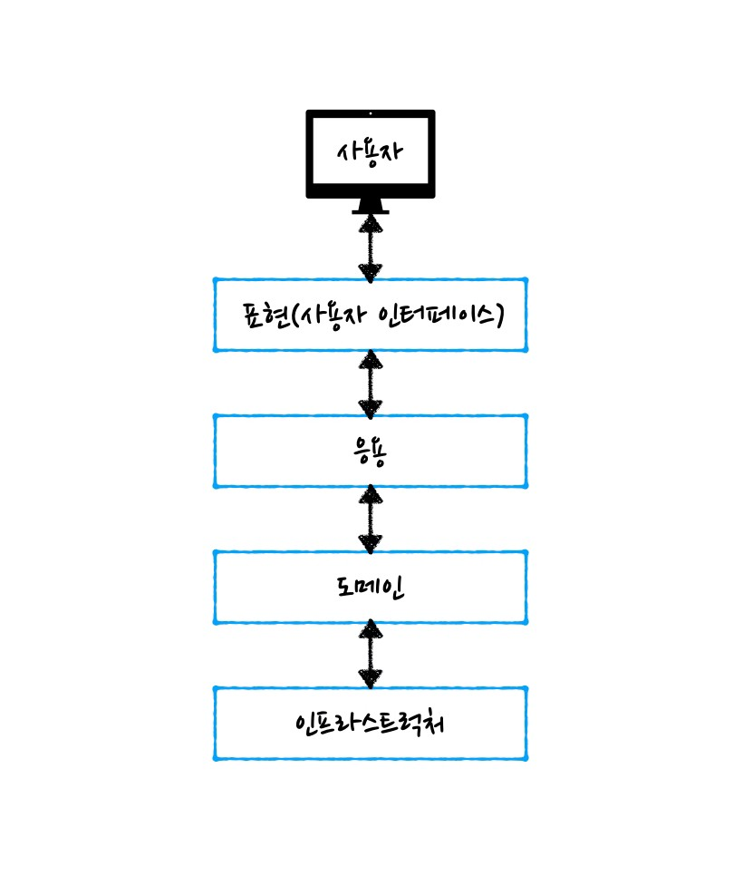
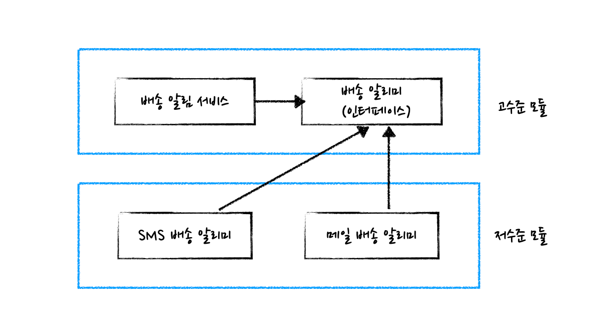
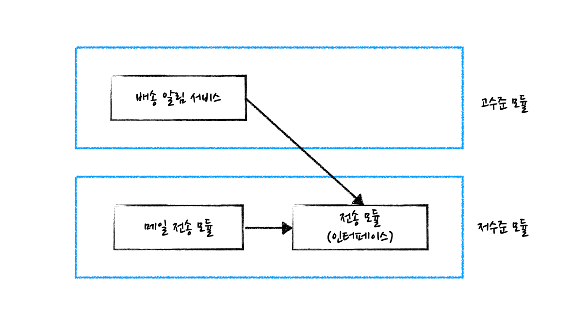

# DDD Start! ( 저자 : 최범균 )

<div align="center">
    
</div>

책만 읽고 있는데 잘 이해가 안감.  
원래 이거 말고도 ddd 관련한 책을 하나 읽었긴 했는데,  
자세히 보단 개념 설명이었음.  

<div align="center">
    
</div>

그러던 중 인터넷에서 직접 강의를 들은 분의 후기를 봄.  
설명을 잘해 주셔서 이해하기 쉬웠음.

---

### 도메인 주도 설계 (DDD)

#### 도메인이란?  

- `해결하고자 하는 문제 영역`

<div align="center">
    
    <p style="font-size:13px">온라인 쇼핑 도메인과 하위 도메인들</p>
</div>
 
- 도메인을 나누는 기준은 절대적인 기준이 아님

#### 도메인 모델 ( Domain Model )  

- UML( Unified Modeling Language )
  - 클래스 다이어그램
  - 상태 다이어그램
  - 시퀀스 다이어그램
  - UML이 아닌 다른 방식으로 표현해도 상관 없음
- 최대한 표현력을 가질수 있게 단순히 속성만 나열하는것이 아닌, 행위를 통해 도메인 기능을 나타내도록, 그리고 실제 사용되는 `도메인 용어  
(실제 서비스 되고 있는 부분에서 사용되는 언어들)`를 사용해야 함

#### Entitiy와 Value  

- `엔티티(Entitiy)`는 고유한 식별자로 식별할 수 있으며 자신의 상태와 라이프 사이클을 가지는 도메인 객체 ( 쉽게 말하면 객체의 상태값과, 특정 동작에 대한 함수들을 정의해놓은 클래스?? )  
- `밸류(Value)`는 개념적으로 묶을 수 있는 데이터 집합
  - VO(Value Object)
  - 각각의 데이터를 단일로 취급할 때보다 표현력을 향상 시킬 수 있음
- 습관적으로 사용하는 setter/getter 메서드는 지양 해야함
- 왜 setter/getter를 지양해야 하는지는 아래의 코드를 보고 이해할 수 있음

```java
public class Order() {
    private long id;
    private OrderStatus status;
    // ...
    
    public OrderStatus getStatus() {
        return this.status;
    }
    
    public void setStatus(OrderStatus status) {
        this.status = status;
    }
    
    public boolean isDeliveryCompletable() {
        return this.status == OrderStatus.DELIVERY_IN_PROGRESS;
    }
    
    public void completeDelivery() {
        this.status = OrderStatus.DELIVERED;
    }
}


public class DeliveryCompleteService() {
    public void completeDelivery(final Order order) {
        // ...do somthing...
        
        // case 1
        if (order.getStatus() == OrderStatus.DELIVERY_IN_PROGRESS) {
            // ...do something...
            order.setStatus(OrderStatus.DELIVERED);
        }
        
        // case 2
        if (order.isDeliveryCompletable()) {
            // ...do something...
            order.completeDelivery();
        }
    }
}
```

- 위의 코드에서 `DeliveryCompleteService의` `completeDelivery` 메서드 내부를 보고 `case1`과 `case2`를 비교
- `case1` 보다 `case2가` 좀 더 의도가 잘 느껴지고 도메인 기능을 잘 표현하고 있음

#### 애그리거트(Aggregate)

- 도메인 모델은 점차 복잡해지기 마련
- 애그리거트는 그런 복잡도를 관리 하기 위한 `도메인 객체들의 묶음이자 집합체`

<div align="center">
    
    <p style="font-size:13px">도메인 객체들을 애그리거트로 묶기</p>
</div>

- 하나의 애그리거트에 포함된 객체들은 도메인 규칙과 요구사항에 따라 함께 취급
- 하나의 애그리거트에 포함된 객체들은 동일하거나 유사한 라이프사이클(함께 - 생성되거나, 함께 제거되거나, 함께 변경되는 등…)을 가져야 함
- 하나의 애그리거트에 포함된 객체는 다른 애그리거트에 포함되지 않아야 함
- 애그리거트는 자기 자신을 관리할 수 있지만 다른 애그리거트를 직접 관리하지 않음
- 애그리거트에는 포함된 객체들의 대표가 되는 `애그리거트 루트`가 필요
- `애그리거트 루트(Aggregate)`
  - 애그리거트 바깥에서 애그리거트에 직접 접근 할수 있는 유일한 곳
  - 위와 같이 사용함으로써 애그리거트에 포함된 객체들의 일관성을 유지할 수 있음

<div align="center">
    
    <p style="font-size:13px">애그리거트 루트</p>
</div>

#### 계층형 아키텍처(Layered Architecture)

- 계층형 아키텍쳐 
  - 표현(사용자 인터페이스)
    - 사용자의 요청을 해석하고 다른 계층에 처리 위임
    - 처리결과를 사용자에게 알맞게 변환 하여 응답해주는 기능
  - 응용
    - 사용자의 요청을 처리하는 기능
    - 서비스 중 응용 서비스가 여기에 포함
    - 일반적인 처리 흐름을 제어하고 실제 도메인 기능은 도메인 객체에 위임
  - 도메인
    - 도메인 기능을 가진 도메인 객체들이 위치하는 곳
    - 엔티티, 밸류, 리포지터리, 서비스 중 도메인 서비스가 여기에 포함
  - 인프라스트럭처
    - 구현 기술이 위치
    - RDBMS 연동, 메시징 플랫폼, HTTP 통신 
    - 저수준의 기능들을 담당

<div align="center">
    
    <p style="font-size:13px">계층형 아키텍처</p>
</div>  

- 계층형 아키텍처에서는 일반적으로 상위 계층이 하위 계층에 의존
  - ex) 표현 -> 응용, 응용 -> 도메인

#### DIP(Dependency Inversion Principle)

- 종속성 역전 (의존성 주입 아님)
- 고수준 모듈과 저수준 모듈로 나눌 수 있음
  - 고수준 모듈 : 의미 있는 단일 기능을 제공하는 모듈
  - 저수준 모듈 : 고수준 모듈의 기능을 구현하기 위해 필요한 하위 기능의 실제 구현인 모듈
- 예시로 `"배송알림"` 기능은 `고수준 모듈` 기능이고,  
`"RDBMS에서 주문의 배송 정보를 조회하고, 주문자에게 메일로 배송 알림 메일을 전송한다"`는 `저수준 모듈`의 기능
- 보통 `고수준 모듈`이 `저수준 모듈`에 `의존`하도록 구현하는데 그럴 경우 `저수준 모듈의 변경이 곧 고수준 모듈의 변경`으로 이어짐
- 고수준 `"배송 알림"에는 변화가 없어도,` 저수준 `"메일로 배송 알림을 전송한다"에서 "SMS로 배송 알림 메시지를 전송한다"`로 바뀌면 `고수준 모듈에도 변경`이 발생함
- 위의 단점을 극복하기 위해 의존관계를 역전시켜 저수준 모듈이 고수준 모듈에 의존하도록 구현하는것을 - `DIP`라고 함

<div align="center">
    
    <span style="font-size:13px">저수준 모듈이 고수준 모듈을 의존</span>
</div>  

- `"배송알림"`기능을 정의한 `"배송알리미" 인터페이스`를 만들고, 저수준 모듈에서 "배송 알리미" 인터페이스를 구현한 저수준 모듈인 `"메일 배송 알리미"`, `"SMS 배송 알리미"`를 만드는 것
- 그렇게 되면 메일에서 메시지로 변경 된다고 해도 고수준 모듈의 변경은 최소화 할 수 있음
- 단 인터페이스를 도출할 때 저수준 모듈의 관점에서 도출하면 안됨

<div align="center">
    
    <p style="font-size:13px">저수준 관점에서 인터페이스를 도출 하면 안됨</p>
</div>  

#### 응용서비스(Application Service)

- 도메인 객체를 이용하여 사용자의 요청에 알맞는 기능을 처리하고 결과를 반환하는 역할
- 표현 계층과 도메인 계층을 연결해주는 일종의 창구 역할
- 응용 계층에 속하기 때문에 도메인과 관련된 로직이 직접적으로 포함되지 않아야 함
- 표현 계층에 의존하지 않아야함
  - 표현계층의 기술인 HTTP 프로토콜에 대한 것(HttpSession, MultipartFile 등)은 사용되지 않아야 함
- 응용 서비스의 전형적인 구현
  - 리포지터리로 사용할 도메인의 애그리거트 루트를 구하고,
  - 애그리거트 루트의 도메인 기능을 실행하고 처리 흐름을 제어 하면서,
  - 처리 결과를 반환
- `"응용 서비스의 메서드 파라미터로 필요한 값들을 넘기는 대신 도메인 객체 자체를 넘기는 최대한 지양 하자"` - `최범균`
- 응용 서비스의 메서드 파라미터로 도메인 객체를 사용하다보면 도메인 객체에 원래는 필요하지 않던 속성들을 추가하기 마련
- 이러한 속성들을 영속화에서 제외하는 경우 이를 위해 별도의 설정을 하는 등의 문제를 야기할 수 있음. 
- 따라서 메서드 파라미터로 도메인 객체가 딱 들어맞는 경우에만 사용할 것을 권장.
- 응용 서비스의 결과로 도메인 객체를 반환하는 것과 조회 전용 객체를 반환하는 것 중 어떤 것이 좋을까? - 별도의 조회 전용객체를 만들어 반환하자

#### 리포지터리(Repository)

- 애그리거트의 영속성을 처리 하기 위해 사용
- 애그리거트 루트 단위로 존재 
- 애그리거트는 그 자체로 하나의 완전한 집합체
- 영속화 할 때 애그리거트 루트인 객체 뿐만 아니라 애그리거트에 포함된 모든 객체를 함께 영속화 해야함
- 즉 애그리거트를 저장소에서 조회하는 경우에도 애그리거트 루트 뿐만아니라 그 외에 애그리거트에 존재하는 객체들을 전부 가져와야 하고 삭제 할때도 마찬가지
- `"JPA의 리포지터리를 사용하여 엔티티 객체를 로딩할때 연관된 객체들을 기본적으로 EAGER 로딩 하고 필요한 경우에만 LAZY 로딩을 사용하기"` - `최범균`  

----
> 출처 
- [https://medium.com/myrealtrip-product/what-is-domain-driven-design-f6fd54051590 - 도메인 주도 설계로 소프트웨어 만들기](https://medium.com/myrealtrip-product/what-is-domain-driven-design-f6fd54051590)  
