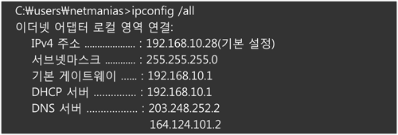
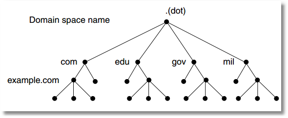

# DNS란 무엇이며 어떻게 작동하는가

- DNS(Domain Name System)는 인터넷의 기초 중 하나
- 호스트의 도메인네임 (www.example.com)을 네트워크주소(192.168.1.0)로 변환하거나, 그 반대의 역학을 수행하는 시스템
- 인터넷이 작았을때는 사람들이 특정 IP 주소를 특정 컴퓨터와 연결하는것이 더 쉬웠음
- 점점 인터넷 사용자가 증가함에 따라 특정 IP주소가 아닌 사람들이 기억하기 쉬운 단어로 구성된 주소를 원함(ex> networkworld.com)

#### DNS 종류

- 신뢰할 수 있는 DNS
  - 개발자가 퍼블릭 DNS 이름을 관리하는데 사용하는 업데이트 메커니즘을 제공
  - 이를 통해 DNS 쿼리에 응답하여 도메인 이름을 IP 주소로 변환
  - 신뢰할 수 있는 DNS는 도메인에 대해 최종권한이 있음
  - 재귀적 DNS 서버에 IP 주소가 정보가 담긴 답을 제공할 책임이 있음

- 재귀적 DNS
  - 보통 클라이언트는 신뢰할 수 있는 DNS 서비스에 직접 쿼리를 수행하지 않음
  - `해석기` 또는 `재귀적 DNS` 서비스라고 알려진 다른 유형의 DNS 서비스에 연결하는 경우가 일반적
  - `재귀적 DNS 서비스`는 호텔 컨시어지와 같은 역할을 함 (컨시어지: 호텔에서 근무하며 투숙객에게 고객이 원하는 요구에 대해 추천을 해줌)
  - DNS 레코드를 소유하고 있지 않지만 사용자를 대신해서 DNS 정보를 가져올 수 있는 중간자의 역할을 함
  - 일정 기간 동안 캐시 또는 저장된 DNS 레퍼런스를 가지고 있는 경우, 소스 또는 IP 정보를 제공하여 DNS 쿼리에 답을 하거나, 해당정보를 찾기 위해 쿼리를 한개 이상의 신로할 수 있는 DNS 서버에 전달함

#### DNS가 동작하는 원리

    

    

1. 사용자가 브러우저에서 www.naver.com를 입력함, PC는 미리 설정되어 있는 DNS(단말에 설정되어 있는 이 DNS를 Local DNS라 부름, 1의 사진에서는 203.248.252.2) 에게 "www.naver.com"라는 "hostname"에 대한 IP 주소를 요청
2. `Local DNS`에는 "www.naver.com"의 IP 주소가 있을 수도 없을 수도 있음, 만약 있을 경우 Local DNS가 사용자에게 IP주소를 주고 끝 하지만 없을 경우로 가정 해봄
3. Local DNS는 이제 "www.naver.com"의 IP 주소를 찾아내기 위해 다른 DNS 서버들과 통신(DNS 메시지)를 시작, Local DNS는 Root DNS에 요청함. 루트 도메인은 아래와 같은 식으로 구성 됨

    
    
도메인 명칭 시스템 계층도

    
DNS 는 각각 이름이 부여된 도메인(domain)이라는 노드(node)로 구성된 트리 구조(tree structure)로 설계되어 있다. 트리의 최상위 노드는 DNS 루트 도메인(DNS root domain)이다. 그 아래에 .com, .edu,, .gov, .mil 같은 하위 도메인(sub domain)들이 존재한다.
    

루트 도메인은 전세계 적으로 13대가 구축 되어 있음

4. Root DNS 서버는 "www.naver.com"의 IP를 찾을 수 없어 Local DNS서버에게 찾을 수 없음을 알리고 다른 Root DNS 서버에게 요청하도록 응답함
5. 다른 DNS 서버는 `com`도메인을 관리하는 DNS 서버
6. Local DNS 서버는 `com` 도메인을 관리하는 DNS서버에 다시 네이버에 대한 IP 주소를 요청
7. 이번에도 못 찾았다는 요청이 오게 되면 이번엔 `naver.com` 도메인을 관리하는 DNS 서버에 요청
8. `naver.com`을 관리하는 DNS 서버에게 다시 네이버 IP 주소를 요청
9. 이번엔 존재 해서 네이버 IP 주소값 222.122.195.6 이라는 응답을 받음
10. 이를 수신한 Loacl DNS는 네이버의 IP 주소를 캐싱하고 이후 다른 요청이 있을시 응답할 수 있도록 IP 주소 정보를 사용자 PC 에 전달함

> Local DNS 서버가 여러 서버에 차례대로 (Root DNS -> com DNS -> naver.com DNS)에 요청하여 답을 찾는 과정을 `Recursive Query`라고 함

---

> 출처

- [DNS? 작동원리-IMBETPY](https://velog.io/@doomchit_3/Internet-DNS-%EC%9E%91%EB%8F%99%EC%9B%90%EB%A6%AC-IMBETPY)
- [https://sunnykwak.tistory.com/99](https://sunnykwak.tistory.com/99 )
