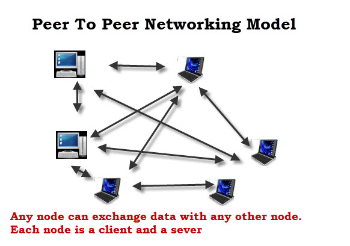

# 기본적인 네트워크 개념

- 오늘날 컴퓨터 네트워크는 어디에나 존재함
- 가정, 사무실, 공장, 병원 레저 센터 등

### 가정 및 사무실 네트워크

- 가정에서 사용되는 네트워크 및 인터넷은 기업에서 사용되는 것과 동일한 네트워킹 기술, 프로토콜 및 서비스를 사용함
- 가정 과 기업 네트워크의 유일한 차이점은 크기
- 가정에서 사용되는 네트워크에는 1 ~ 20개의 장치가 있고 기업 네트워크에는 수천개의 장치가 있음

### 네트워크 유형 및 구조

- 유선 or 무선, 대부분은 둘 다 혼합

#### 유선 

- 장점 
  - 이더넷 포트는 거의 모든 랩톱 / PC 및 넷북에서 발견
  - 유선 네트워크는 무선보다 빠름 
  - 무선보다 더 안전
- 단점
  - 보기 흉하고 실행하기 어렵고 비용이 많이 드는 케이블을 사용해야함
  - 건물 간 쉽게 사용할 수 없음
  - 소규모 사무실, 가정에서 일반적
  - 휴대폰 및 태블릿에서는 지원되지 않음

#### 무선

- 장점
  - 일반적으로 설정하기가 더 쉬움
  - 가정 및 공용 네트워크 모두에서 사용가능
  - 케이블이 필요하지 않음
  - 휴대폰 및 태블릿과 함께 사용가능
- 단점
  - 일반적으로 유선보다 느림
  - 범위에 의해 제한됨
  - 도청이 가능함
  - 설정에 따라 안전하지 않음

### 네트워킹 토폴로지 및 레이아웃

- 네트워크 노드를 함께 연결할 수 있는 방법
- 네트워크가 커질 수록 중요해짐
- 네트워크를 설계하고 연결 프로토콜을 선택할때 이러한 토폴로지를 이해하는 것이 중요
  - Bus, Ring, Mesh, Star, Hybrid

#### 네트워킹 토폴로지 - 물리적 vs 논리적

- 네트워크 노드가 서로 통신하는 방법은 물리적으로 상호 연결되는 방법과 매우 다를 수 있음
- 대부분의 가정 및 소규모에서는 물리적 버스 토폴로지르르 사용
- 일반적인 논리적 유형은 Peer to Peer 와 Client Server
- 웹(WWW)은 논리적 수준에서 Client Server Network 임

#### Peer to Peer

    
    
Peer to Peer Networking Model

- 장점 
  - 더 쉬운 설정
  - 단일 노드에 의존하지 않음
  - 더 탄력적
  - 네트워크 트래픽의 더 나은 분배
  - 중앙 관리자가 필요하지 않음
  - 덜 비싼 하드웨어의 필요
- 단점
  - 덜 안전하고 보안이 어려움
  - 관리하기 더 어려움
  - 백업하기 더 어려움
  - 정보를 찾기 더 어려움

> 현대적인 예시는 `BitTorrent`, 나중에 IOT에서 더 인기를 끌 수 있는 네트워크 모델링

---

> 출처

- [Basic-Networking-Concepts-Beginners Guide](http://www.steves-internet-guide.com/networking/)
