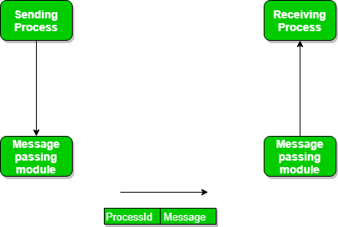

# Inter Process Communication (IPC)

- IPC란 내부 process끼리 대화하는 것 
- 독립적 과정
  - 다른 프로세스의 영향을 받지 않음
- 공동 작업 프로세스
  - 다른 실행 프로세스의 영향을 받을 수 있음
  - 실제로 협동성을 이용하여 연산 속도, 편의성, 모듈성을 높일 수 있는 상황이 많음
- IPC는 프로세스가 서로 통신하고 작업을 동기화 할 수 있는 메커니즘

## IPC의 협력 방법

    
    
Shared Memory / Message Passing

### Shared Memory 방식

- 공유 메모리를 사용하는 프로세스 간 통신에는 일부 변수를 공유하기 위한 프로세스가 필요
- 프로그래머가 이를 어떻게 구현할지에 따라 완전히 달라짐
- 공유 기억 방법
- 공유 메모리를 사용하는 통신 방법 중 하나는 다음과 같음
  - 프로세스 1과 프로세스2가 동시에 실행되고 일부 리소스를 공유하거나 다른 프로세스의 정보를 사용 한다고 가정
  - 프로세스 1은 사용중인 특정 계산이나 리소스에 대한 정보를 생성하여 공유 메모리에 기록으로 보관 
  - 프로세스 2가 공유된 정보를 사용해야 할 경우 공유 메모리에 저장된 레코드를 체크인 하고 프로세스 1이 생성한 정보를 메모한 후 이에 따라 행동함
  - 프로세스는 공유메모리를 사용하여 정보를 다른 프로세스에서 레코드로 추출할 뿐만 아니라 특정 정보를 다른 프로세스에 전달

### Message Passing 방식

    
    
message-passing

- 메시지 전달 방법
- 프로세스는 공유 메모리를 사용하지 않고 서로 통신
- 두 프로세스 p1, p2가 서로 통신하고자 할 경우 다음과 같이 진행
  - 통신 링크 설정
  - 기본 원리를 사용하여 메시지 교환을 시작 ( 송신, 수신 )
- 메시지 크기는 고정 크기 또는 변수 크기 일 수 있음
- 표준 메시지는 헤더와 본문이라는 두 부분으로 나눌 수 있음
- 헤더 부분은 메시지 유형, 대상 ID, 소스 ID, 메시지 길이 및 제어 정보를 저장하는데 사용
- 일반적으로 메시지는 FIFO 스타일을 사용하여 전송

#### 통신 링크를 통한 메시지 전달

- 직접 및 간접 통신 링크
- 내부 통신은 메시지 대기열로 구성된 공유 사서함(포트)을 통해 이루어짐

#### 메시지 교환을 통한 메시지 전달

- 동기식 및 비동기식 메시지 전달
  - 송신 및 수신 차단 (Blocking send and blocking receive)
  - 비차단 송신 및 비차단 수신 (Non-Blocking send and Non-blocking receive)
  - 비차단 송신 및 차단 수신(대부분 사용) (Non-Blocking send and Blocking receive)
- 직접 메시지 전달
- 간접 메시지 전달(포트 사용)
  - Pub, Sub
- 클라이언트/서버 아키텍처 통신
  - 파이프
  - 소켓
  - 원격 절차 호출 (RPC)
  
  ---

  >출처

  - [Inter Process Communication (IPC)](https://www.geeksforgeeks.org/inter-process-communication-ipc/)