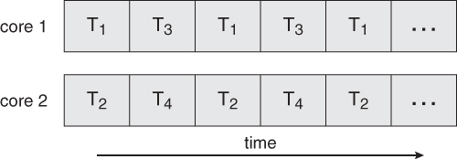

# 쓰레드와 병행성

- 스레드는 `CPU 스케줄링의 기본 단위` 또는 `한 프로세스 안에서 제어의 흐름`
- PC, 레지스터 집합, 스택 공간으로 이루어져 있으며 프로세스와 유사하지만 오버헤드를 줄일 수 있드록 크기가 더 작음
- 각각의 스레드는 자신만의 레지스터 상태와 스택을 가짐
- 같은 프로세스 안에서 여러 스레드가 생성될 수 있고, 프로세스를 위한 `코드와 주소 공간 그리고 운영 자원`을 공유할 수 있음
- 스레드가 실행되는 환경을 *task* 라고 부르며 전통적 프로세스(heavyweight)는 한 스레드가 있는 하나의 task와 같음
- 스레드는 작은 context를 사용함으로써 생성과 스위칭에 드는 비용을 줄일 수 있음

#### Concurrency(병행성)

- 응용프로그램에서의 병행성 사용은 여러 이점을 가짐
- 병행성은 병행적인 프로세스들의 집합으로서 응용프로그램을 구조화 함으로써 구현될 수 있음

#### Overhead in Process Model

- 여러 개의 프로세스를 사용하는 모델에서 각각의 프로세스는 독립적, 따라서 통신을 위해서는 커널을 통한 IPC가 필요. 이는 오버헤드가 큼
- 또한 이 모델에서 PCB(Process Context Block)는 큰 크기를 가지고 있어, 각각의 프로세스의 생성과 context 스위칭에 오랜 시간이 걸림

    
    
싱글 스레드 / 멀티 스레드

- 위의 그림에서 왼쪽의 싱글 스레드 프로세스는 기존의 프로세스와 같음
- 오른쪽의 멀티 스레드 프로세스는 기존의 PCB보다 훨씬 작은, 여러개의 PCB를 가지며 공유된 데이터를 통해 통신을 더 쉽게 할 수 있다. 이로 인해 context 스위칭도 더 쉬워짐

#### Multithreading(Single Processor)

    
    
멀티쓰레드-싱글 프로세스

- `병행성`을 달성(병렬적인 형태로 보임)
  - 두 task는 그들이 병렬적으로 수행되는 것처럼 보이나 실제로는 한 시점에 둘 중에 하나만 수행되고 있을때 병행성을 이루었다고 함
  - 이는 하나의 프로세스 시스템에서도 `계산 속도를 증가`시키는데, 왜냐하면 I/O bound 스레드 블록이 있다면, 커널은 같은 프로세스의 다른 스레드로 스위치하기 때문

#### Multithreading(Multiple Processor or Cores)

    
    
멀티쓰레드-멀티 프로세스

- `병렬성`을 달성(동시에 여러 스레드를 실행)
  - 두 task는 그들이 동시에 수행될 때 병렬성을 이루었다고 함
  - 한 프로세스의 스레드들도 다른 프로세서나 코어(멀티 코어)에서 병렬적으로 실행 될 수 있음
  - CPU의 병렬성이 아닌 코어에서 병렬성을 말함

#### 스레드의 이점

- 병행성과 병렬성을 달성
- 계산과 I/O를 오버랩
- MP 아키텍처의 효용성을 높임
- 반응적임
- 자원을 공유함
- 경제적임

---

> 출처

- [[OS] concurrency and thread](https://velog.io/@ssseungzz7/OS-concurrency-and-thread)