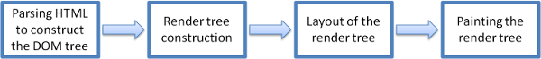

# 웹브라우저는 어떻게 작동하는가

#### 브라우저(Browers)

- 웹 페이지, 이미지, 비디오 및 기타 파일을 포함하여 WWW(World Wide Web)에서 콘텐츠를 찾고, 검색하고, 표시하는데 사용되는 소프트웨어 응용 프로그램
- 클라이언트 / 서버 모델로서 브라우저는 웹 서버에 접속하여 정보를 요청하는 컴퓨터에서 실행되는 클라이언트
- 웹 서버는 브라우저를 지원하는 컴퓨터 또는 기타 인터넷 사용 가능 장치에 결과를 표시하는 웹 브라우저로 정보를 다시 보냄
- 브라우저는 일련의 작업을 함께 수행하여 화면에 웹 페이지를 표시하는 구조화 된 코드 그룹
- 브라우저 마다 구성하고 있는 코드(언어)는 다름

#### 브라우저의 고급 아키텍처

    
    브라우저 주요 구성요소

- 사용자 인터페이스(User Interface)
  - 사용자가 브라우저와 상호 작용 하는 공간
  - 주소표시줄, 뒤로, 다음, 홈, 새로고침, 중지, 북마크, 옵션등이 포함됨
  - 요청 된 웹 페이지가 표시되는 창을 제외한 다른 모든 부분
- 브라우저 엔진(Browser Engine)
  - 사용자 인터페이스와 렌더링 엔진간의 다리 역할
  - 다양한 사용자 인터페이스의 입력에 따라 렌더링 엔진을 쿼리 하고 조작
- 렌더링 엔진(Rendering Engine)
  - 브라우저 화면에서 요청 된 웹페이지를 렌더링 하는 역할
  - css를 사용하여 형식이 지정된 HTML,XML문서 및 이미지를 해석하고 사용자 인터페이스에 표시되는 레이아웃을 생성
  - 그러나 플러그인 또는 확장 플러그인을 사용하면 다른 유형의 데이터도 표시 가능
  - 브라우저마다 다른 렌더링 엔진 사용
    - Internet Explorer : Trident
    - Firefox 및 기타 Mozilla 브라우저 : Gecko
    - Chrome 및 Opera 15+ : Blink
    - Chrome (iPhone) 및 Safari : Webkit
- 네트워킹(Networking)
  - HTTP, FTP등 일반적인 인터넷 프로토콜을 사용하여 URL을 검색하는 브라우저의 구성 요소
  - 인터넷 통신 및 보안의 모든 측면을 처리
  - 구성요소는 네트워크 트래픽을 줄이기 위해 검색된 문서의 캐시를 구현 할 수 있음(캐싱)
- 자바스크립트 인터프리터(Javascript Interpreter)
  - 웹 사이트에 내장 된 자바 스크립트 코드를 해석하고 실행하는 브라우저의 구성요소
  - 해석된 결과는 표시를 위해 렌더링 엔진으로 전송
  - 스크립트가 외부인 경우 먼저 네트워크에서 리소스를 가져옴, 구문 분석기는 스크립트가 실행 될 때 까지 보류 상태를 유지
- UI 백엔드(UI Backend)
  - 콤보 상자 및 창 과 같은 기본 위젯을 그리는데 사용 됨
  - 특정 플랫폼이 아닌 일반 인터페이스를 노출
  - 운영체제 사용자 인터페이스 방법이 사용됨
- 데이터 지속성/저장(Data Persistance)
  - 지속성 계층 
  - 브라우저는 localStorage, IndexedDB, WebSQL 및 FileSystem과 같은 저장 메커니즘을 지원
  - 브라우저가 설치된 컴퓨터의 로컬 드라이브에 생성 된 작은 데이터베이스
  - 캐시, 쿠키, 북마크 및 기본 설정과 같은 사용자 데이터를 관리

> Google Chrome과 같은 웹 브라우저에서는 각 탭이 별도의 프로세스(렌더링 엔진의 여러 인스턴스) 에서 실행 됨

#### 렌더링 엔진

- 네트워크 계층은 요청 된 문서의 정보를 8KB 단위로 렌더링 엔진에 보냄

    
    렌더링 엔진 기본 흐름

- HTML 문서의 정보를 구문 분석하고 요소를 `"content tree"` 또는 `"DOM tree"`로 변환함
  - 그 외에도 스타일 요소에서 외부 css 파일도 모두 분석함
- DOM 트리가 구성되는 동안 브라우저는 다른 트리인 `"render tree"`를 구성 함
  - 이 트리는 순서대로 표시 될 시각적 요소로 구성됨 (문서의 시각적 표현)
  - Firefox에서는 렌더 트리의 요소를 `"프레임"`이라고 함, WebKit은 렌더러 또는 렌더 객체라는 용어를 사용
- 렌더 트리를 구성한 후 렌더 트리의 `"layout process"`를 거침
  - 렌더러가 처음 생성되어 트리에 추가 되면 layout에 적용될 위치와 크기가 존재하질 않음
  - 이러한 값을 계산하는 과정을 레이아웃 또는 리플 로우라고 함
  - 즉, 각 노드에 화면에 표시되어야 하는 정확한 좌표를 제공함
  - 루트 렌더러의 위치는 0,0 이고 치수는 브라우저 창의 보이는 부분이 뷰 포트
  - 모든 렌더러에는 레이아웃 또는 리플로우 메서드가 존재하며 각 렌더러는 레이아웃이 필요한 자식의 레이아웃 메소드를 호출
- 페인팅
  - 렌더 트리가 완료되고 렌더러의 `"paint()"`메서드가 호출되어 화면에 콘텐츠를 표시
  - 페인팅은 UI 백엔드 레이어를 사용
- 렌더링 엔진은 더 나은 사용자 경험을 위해 항상 가능한 빨리 화면에 내용을 표시하려고 함
  - 렌더 트리를 빌드하고 레이아웃하기 시작하기전에 HTML 구문분석이 완료 될때까지 기다리지 않음
  - 네트워크에서 수신 한 콘텐츠를 구문 분석하고 표시하는 반면 나머지 컨텐츠는 네트워크에서 계속 전송 함

---
>출처  

- [[https://medium.com/@monica1109/how-does-web-browsers-work-c95ad628a509 - How does web browsers work?]](https://medium.com/@monica1109/how-does-web-browsers-work-c95ad628a509)
