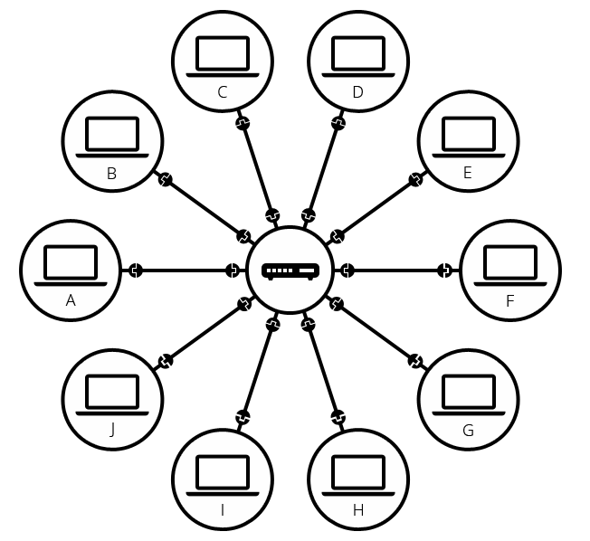
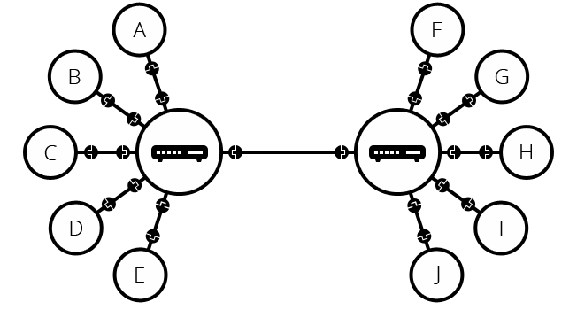
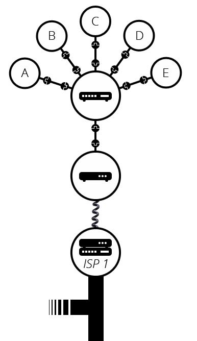
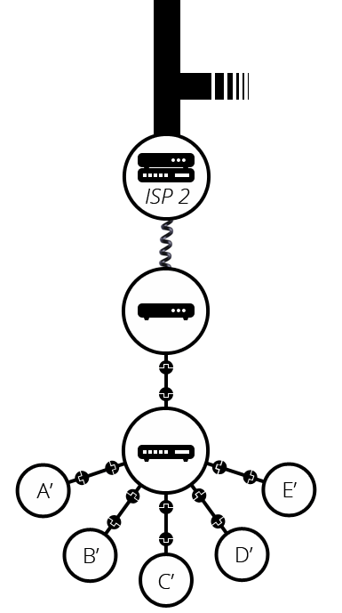

### 인터넷은 어떻게 동작되는가?  

| 요약 |
|:------:|
|`인터넷`은  웹의 핵심적인 기술|
|`인터넷`은 컴퓨터들이 통신 가능한 거대한 네트워크|
  
- 컴퓨터가 통신이 필요할때 물리적연결(이더넷) 또는 무선(wifi, bluetooth)을 사용함
- 위와 같은 행위를 네트워크라 하고 네트워크 확장엔 제한이 없음
- 연결하면 할 수록 복잡해짐
- 위와 같은 문제를 해결하기 위해 `라우터`라는 특수한 소형 컴퓨터를 사용

  

- 하지만 네트워크 확장을 점점 더 하게 된다면 `단일 라우터`로는 감당하기 어려움
- 그래서 `라우터`와 `라우터`를 서로 연결할 수 있음

  

- 하지만 근교가 아닌 먼 지역과 통신을 해야 한다면 어떻게 해야함?
- 그래서 우리는 기존에 사용되는 `전화선`을 이용함 
- `전화시설`과 연결하기 위한 `모뎀`이란 특수장비를 사용
- `모뎀`을 통해 네트워크를 인터넷 서비스 제공업체`(Internet Service Provier, ISP)`와 연결을 함
- `ISP`는 모두 함께 연결되는 몇몇 특수한 라우터를 관리하고 다른 ISP의 라우터에도 엑세스 할 수 있는 회사
(한국에서는 `KT`, `SK`, `LG`로 볼 수 있음)

  
  

> 인터넷은 수십억대의 컴퓨터를 연결하는 기술 인프라
