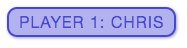

# JavaScript란?

- 복잡한 무언가( 주기적으로 내용이 갱신되는 기능이나 능동적인 지도, 변화하는 2D/3D 그래픽, 동영상등)를 웹페이제 적용할 수 있게 하는 스크립트 혹은 프로그래밍 언어
- 표준 웹 기술이라는 레이어 케이크에서 세번째 층이라고 볼 수 있음

<div align="center">
    
    <p style="font-size:13px; color:gray;">레이어 케이크</p>
</div>

- HTML은 웹컨텐츠의 구조와 의미를 문단, 제목, 표, 이미지, 동양상등으로 정의하고 부여하는 마크업 언어
- CSS는 배경색, 폰트 등의 레이아웃을 지정하여 HTML 컨텐츠를 꾸며주는 스타일 규칙 언어
- JavaScript는 동적으로 컨텐츠를 바꾸고, 멀티미디어를 다루고, 움직이는 이미지 그리고 꽤나 많은 다른 일 들을 할 수 있는 스크립트 언어

1. HTML을 사용하여 그 구조와 목적에 맞게 마크업을 할 수 있음

```HTML
<p>Player 1: Chris</p>
```

<div align="center">
    
</div>

2. CSS를 추가하여 예쁘게 꾸밀 수 있음

```CSS
p {
  font-family: 'helvetica neue', helvetica, sans-serif;
  letter-spacing: 1px;
  text-transform: uppercase;
  text-align: center;
  border: 2px solid rgba(0,0,200,0.6);
  background: rgba(0,0,200,0.3);
  color: rgba(0,0,200,0.6);
  box-shadow: 1px 1px 2px rgba(0,0,200,0.4);
  border-radius: 10px;
  padding: 3px 10px;
  display: inline-block;
  cursor:pointer;
}
```

<div align="center">
    
</div>

3. 자바스크립트로 동적인 기능을 추가 할 수 있음

```Javascript
const para = document.querySelector('p');

para.addEventListener('click', updateName);

function updateName() {
  let name = prompt('Enter a new name');
  para.textContent = 'Player 1: ' + name;
}
```

#### JAVASCRIPT가 하는 일

- 변수안에 값을 저장할 수 있음
- 프로그래밍에서 '문자열(string)'이라고 불리는 문자들도 조작 가능
- 웹페이지상의 이벤트에 응답하는 코드를 작성 할 수 있음
- APIs(Application Programming Interfaces)라는 자바스크립트 코드에서 사용 할 수 있는 추가적인 강력한 기능을 제공
- Browser API
  - DOM(Document Object Model) API는 동적으로 페이지의 스타일을 정하는 등 HTML과 CSS를 알맞게 조정하는 역할을 함, 사진과 같이 컨텐츠 들이 보여지는 것들이 모두 DOM의 결과라고 볼 수 있음
  - Geolocation API는 지리적인 정보를 검색하게 해줌, 이는 Google Maps이 어떻게 위치를 찾고 지도에 표시하는지 알 수 있게함
  - Canvas와 WebGL API는 2D와 3D 그래픽을 만들 수 있도록 함
  - HTMLMediaElement와 WebRTC 같은 Audio and Video API는 음악과 비디오를 웹 페이지 상에서 제ㅐ생하고, 웹캠으로 캠처하고 다른 컴퓨터에 표시하는 등의 멀티미디어를 활용할 수 있는 재미있는 기술을 지원함

  > 대부분의 데모 코드들은 오래된 브라우저에서는 실행이 안될수 있으니, FireFox, Chrome, Edge, Opera와 같은 최신 브라우저를 사용하는걸 추천함

> #### 웹페이지에서 동적인 기능들을 실행시키기 위한 스크립트 언어

---

> 출처

- [[JavaScript가 뭔가요? - Web 개발 학습하기|MDN]](https://developer.mozilla.org/ko/docs/Learn/JavaScript/First_steps/What_is_JavaScript)
